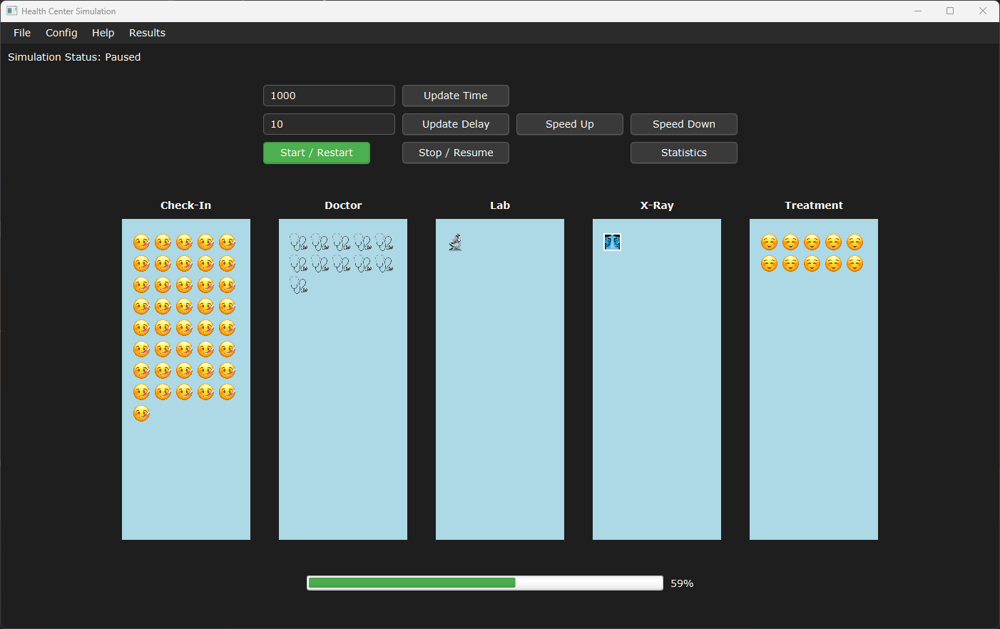

# Health Center Simulator

## Overview

The Health Center Simulator is a Java-based simulation application that models patient flow through various service points in a healthcare center, such as check-in, doctor consultation, lab, x-ray, and treatment. The simulation uses JavaFX for its graphical user interface (GUI) and models healthcare workflows using different probabilistic distributions for realistic patient behaviors. Additionally, it connects to a MariaDB database for storing simulation results and configurations.



## Features
- **Patient Flow Simulation:** Models patient movement through different service points, with decisions based on configurable probabilities.
- **Configurable Distributions:** Service points can use different distributions (e.g., Negexp, Poisson) for generating event times.
- **Real-time Visualization:** Displays patient movement and activities in a graphical interface using JavaFX.
- **Database Connectivity:** Utilizes a MariaDB database to store and retrieve distributions, probabilities, and simulation results via JPA.
- **Statistics Collection:** Gathers and displays simulation statistics like the number of patients served, average time spent, etc.
- **Customizable Parameters:** Users can set simulation parameters like arrival times, service times, and routing probabilities via the GUI.

## Project Structure

```bash
src/
├── main/java/org/group8
│   ├── controller        # Controllers for managing simulation and data
│   ├── dao               # Database access objects for CRUD operations
│   ├── datasource        # MariaDB database connection using JPA
│   ├── distributions     # Distribution models for simulating service times
│   ├── simulator         # Core simulation logic
│   └── view              # JavaFX GUI components
├── resources/META-INF
│   └── persistence.xml   # JPA configuration
└── Main.java             # Entry point for the JavaFX application
```

# Installation and Setup

## Prerequisites
- Java 11 or higher
- MariaDB (or compatible database server)
- JDBC Driver for MariaDB
- JavaFX SDK (required for GUI)

## Setting up the Database

### Create the MariaDB Database
Run the following command to create a new database:

```sql
CREATE DATABASE healthcare_simulation;
```

## Configure Database Connection
Update the .env file with your database credentials::

```bash
JDBC_URL=jdbc:mariadb://localhost:3306/healthcare_simulation
JDBC_USER=your_username
JDBC_PASSWORD=your_password
```

## Set Up Database Schema
For the first run, ensure that your `persistence.xml` file is set to automatically drop and create the database schema. This can be found in `src/main/resources/META-INF/persistence.xml`:

```xml
<property name="jakarta.persistence.schema-generation.database.action" value="drop-and-create"/>
```

After the first run, you should change this value back to none to avoid losing data:

```xml
<property name="jakarta.persistence.schema-generation.database.action" value="none"/>
```

## Running the Application

Once the prerequisites are set up and the database is configured, simply run the `Main.java` file in your IDE or using the command line.

- **Run in an IDE**: Open the project in your IDE (like IntelliJ IDEA or Eclipse), navigate to `Main.java`, and run the file.
  
- **Run from the Command Line**:

If you want to run from the command line:

```bash
java --module-path /path/to/javafx-sdk-20/lib --add-modules javafx.controls,javafx.fxml -cp src/main/java org.group8.Main
```

Make sure you replace `/path/to/javafx-sdk-20/lib` with the actual path to your JavaFX SDK.

# Main Components

### Controller Layer
- **HealthcenterController.java**: Manages the simulation flow and interaction between the user interface (GUI) and the simulation engine.
- **DataController.java**: Handles data operations related to probabilities, distributions, and simulation results.

### Model Layer
- **HealthCentre.java**: The core simulation class that models patient flow between service points using arrival processes and distributions.
- **Patient.java**: Represents patients in the simulation, tracking their movement, time spent, and completion status.
- **ServicePoint.java**: Models individual service points (e.g., check-in, doctor, lab) where patients are processed.

### View Layer
- **HealthcenterGUI.java**: The main GUI class built using JavaFX that provides the interface for running and visualizing the simulation.
- **Visualization.java**: Handles graphical representation of patients on the simulation canvas.

### Data Access Layer
- **DistributionDao.java**: Handles CRUD operations for distributions stored in the database.
- **ProbabilityDao.java**: Handles CRUD operations for decision probabilities stored in the database.
- **SimulationResultsDao.java**: Manages the persistence of simulation results to the database.
- **MariaDbJpaConnection.java**: Provides a singleton connection to the MariaDB database using JPA.

# How to Use

### Main GUI Features
- **Run/Stop Simulation**: Start or stop the patient flow simulation.
- **Set Simulation Time**: Enter the total time for the simulation run.
- **Adjust Simulation Speed**: Increase or decrease the speed of the simulation.
- **Statistics**: View detailed statistics after the simulation ends.
- **Edit Configurations**: Modify the distribution and average times for each service point.
- **Edit Probabilities**: Update the routing probabilities for patients moving between service points (e.g., doctor to lab, x-ray, or treatment).

### Database Operations
- **Probabilities**: The system stores routing decisions' probabilities in the database and allows users to modify them.
- **Distributions**: The system stores distributions and average times for each service point in the database, allowing customization.
- **Simulation Results**: Each simulation run’s results are saved to the database for future reference and statistical analysis.

# Example Output

After running a simulation, you will see visual representations of patients moving through various service points in the health center. Key statistics will also be shown:

```bash
--- Simulation statistics ---
Simulation ended at time 5000
Total patients arrived at healthcare centre: 150
Total patients completed the visit: 145
Average time spent by all patients: 12.34 units
```

## Documentation

The full API documentation for the Health Center Simulator is available in the `/docs` folder. To view the generated Javadoc, open the `index.html` file located in the `/docs` directory.

[View API Documentation](./docs/index.html)

#License

This project is open-source. Feel free to modify and enhance it as per your needs.
